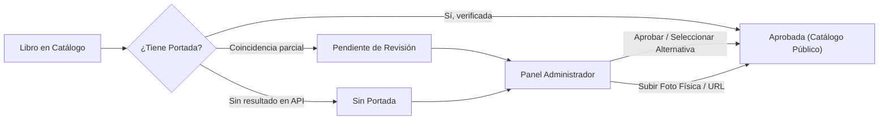

# Manual de Uso: Catálogo Visual y Gestión de Portadas
### Biblioteca Popular Dr. Lautaro Roncedo (Alcira Gigena)

---

## 1. Introducción y Propósito

El sistema de portadas transforma el catálogo de la Biblioteca Roncedo (1.283 volúmenes registrados) en una **Biblioteca Visual interactiva**. Permite a los socios reconocer las obras a primera vista desde cualquier dispositivo (computadora, tablet o celular) y proporciona al equipo de biblioteca un control absoluto para supervisar, aprobar o cargar manualmente las imágenes de cada libro.

---

## 2. Experiencia del Socio: Exploración del Catálogo

### 2.1 Modos de Visualización
Al ingresar a la sección de **Libros Físicos** (`/libros`), el usuario dispone de un selector de vista en la esquina superior derecha:

1. **Modo Fichas (Detalle bibliográfico)**: 
   - Muestra la información técnica completa (número de inventario, autor, título, año, editorial, estado de disponibilidad).
   - Ideal para búsquedas precisas por signatura topográfica o investigación bibliográfica.
2. **Modo Biblioteca Visual (Estantería gráfica)**:
   - Organiza los libros con énfasis prioritario en sus portadas.
   - Si un libro aún no posee portada o está en trámite, se presenta con una carátula tipográfica elegante y armónica inspirada en la encuadernación institucional.
   - Preserva la proporción original de cada libro (sin recortes ni estiramientos deformados gracias a la regla de renderizado proporcional `object-contain`).

### 2.2 Ficha Individual y Reserva
Al hacer clic sobre cualquier libro:
- Se abre la **Ficha Individual**, donde la portada se amplía conservando nitidez y relación de aspecto.
- El socio puede verificar si el ejemplar se encuentra en sala o prestado, su fecha estimada de devolución y solicitar anotarse en la **Lista de Espera**.

---

## 3. Panel de Administración: Sección "Gestión de Portadas"

Para acceder a este panel, ingresar con cuenta de administrador a `/admin` y seleccionar la pestaña **"Gestión de Portadas"**.

---

### 3.1 Tablero de Control (KPIs en Tiempo Real)

En la parte superior de la pantalla se visualizan cuatro tarjetas estadísticas:

| Indicador | Descripción | Acción recomendada |
| :--- | :--- | :--- |
| **Total Libros Registrados** | Los 1.283 ejemplares del patrimonio de la biblioteca. | Referencia global de inventario. |
| **Portadas Encontradas** | Cantidad de portadas aprobadas y visibles en el catálogo. | Portadas firmes y resguardadas. |
| **Pendientes de Revisión** | Portadas donde la API halló una edición similar o antología que requiere el ojo del bibliotecario. | Revisar y pulsar "Aprobar" o elegir "Alternativas". |
| **Sin Portada** | Ejemplares locales, independientes o históricos sin digitalización previa. | Cargar foto del libro físico tomada en la biblioteca. |

---

### 3.2 Cómo Revisar y Aprobar Portadas Pendientes

Cuando el sistema automático tiene dudas sobre la edición exacta (por ejemplo, antologías de cuentos o tomos de colecciones):

1. Seleccionar la pestaña de filtro **"Pendientes de Revisión"**.
2. Cada tarjeta exhibirá la portada propuesta junto con:
   - El título y autor registrado en la biblioteca.
   - El título y autor devuelto por la fuente externa.
   - La etiqueta de confianza (**Media** o **Alta**).
3. **Para confirmar la portada:** Pulsar el botón verde **"Aprobar Portada"**. Inmediatamente pasará al estado definitivo y se publicará en el catálogo.
4. **Si la portada no corresponde:** Pulsar el botón **"Descartar"** o consultar las **"Alternativas"**.

> [!TIP]
> **Explorador de Alternativas:** Al hacer clic en **"Ver alternativas"**, el sistema consulta en vivo opciones secundarias encontradas en Google Books y Open Library para que puedas elegir con un solo clic la que coincida exactamente con la edición física que está en la estantería.

---

### 3.3 Cómo Cargar o Reemplazar una Portada Manualmente

Para aquellos libros que no tengan resultado en las bases públicas o cuya edición sea de imprenta local (por ejemplo, editoriales cordobesas o ediciones de autor):

1. En la tarjeta del libro, hacer clic en **"Cargar Portada"**.
2. Podés elegir entre dos métodos sencillos:
   - **Opción A (Subir imagen desde tu dispositivo):** Ideal si tomaste una foto con el celular a la tapa del libro en la biblioteca. Hacés clic en *Seleccionar archivo*, elegís la foto (JPEG, PNG o WebP) y el sistema la optimiza y la asocia al instante.
   - **Opción B (Pegar enlace URL):** Si encontraste la imagen en la web oficial de la editorial o en una librería, pegás el enlace directo y pulsás *Guardar*.

> [!IMPORTANT]
> **Regla de No Sobre-escritura:** Cualquier portada aprobada o cargada manualmente por el bibliotecario queda protegida de forma permanente. Ningún proceso automático posterior la reemplazará sin tu consentimiento explícito.

---

### 3.4 Búsqueda Individual y Procesamiento por Lotes

- **Búsqueda Individual ("Auto-Buscar"):** En cualquier libro de la lista podés presionar el botón de búsqueda con icono de lupa/rayo para que el sistema consulte de inmediato las fuentes bibliográficas.
- **Procesamiento por Lotes:** Permite ejecutar la búsqueda asistida sobre bloques de libros no procesados. Durante la ejecución, se despliega una barra de progreso que indica el porcentaje completado, el libro actual en análisis y las coincidencias obtenidas.
- **Botón "Guardar en Servidor":** Asegura la sincronización y persistencia directa en los archivos maestros de la biblioteca para despliegue en Vercel.

---

## 4. Incorporación de Nuevos Libros (Automatización Permanente)

Cada vez que ingrese un nuevo ejemplar a la Biblioteca Roncedo:

1. Ir a `/admin` ➔ Pestaña **"Libros Físicos"** ➔ Botón **"+ Nuevo Libro"**.
2. Completar los campos habituales (Número de Inventario, Título, Autor, Editorial, Año, Ubicación Topográfica).
3. **Campo ISBN (Opcional pero muy recomendado):** Si el libro posee código de barras o ISBN en la página de créditos, ingresalo en el campo correspondiente.
4. Pulsar el botón **"Auto-Buscar Portada"**:
   - El sistema priorizará el ISBN. Si no hay ISBN, analizará el Título y Autor.
   - Si encuentra coincidencia confiable, la portada aparecerá de inmediato en la previsualización del formulario.
5. Al hacer clic en **"Guardar Libro"**, el registro quedará incorporado con su portada asociada y lista para el disfrute de los socios.

---

## 5. Resumen de Buenas Prácticas

1. **Fotografía de portadas físicas:** Al tomar fotos con el teléfono en la biblioteca, procurá hacerlo con buena iluminación frontal, evitando sombras de las manos o reflejos intensos sobre plastificados brillantes.
2. **Preservación del inventario:** Las funciones de portadas jamás alteran el número de inventario, datos del donante, ubicación ni estado de los préstamos.
3. **Respaldo:** Podés descargar una copia de seguridad en Excel en cualquier momento desde el botón **"Exportar a Excel"** en la barra superior de Gestión de Portadas.
